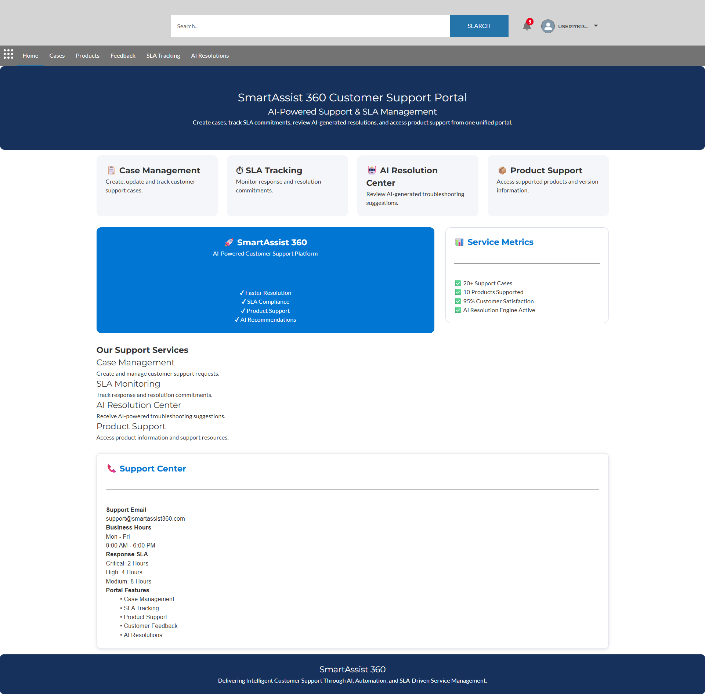
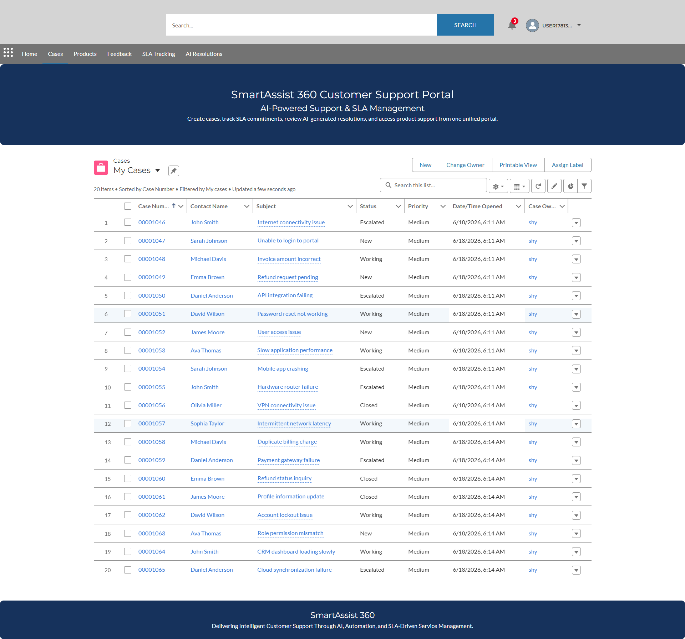
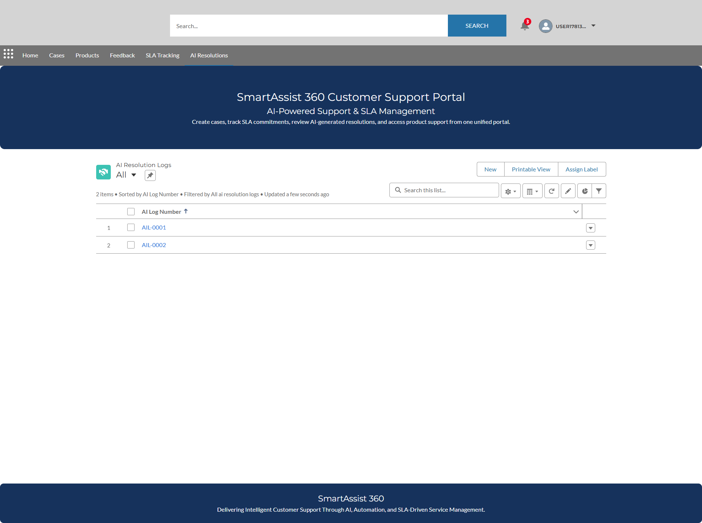

# 🚀 SmartAssist 360 – AI-Powered Customer Support Platform

## Overview

SmartAssist 360 is an enterprise-grade Customer Support and SLA Management Platform built on Salesforce. The solution streamlines customer service operations by combining case management, SLA monitoring, AI-powered resolution recommendations, product support management, and a self-service Experience Cloud portal.

The platform demonstrates Salesforce development best practices including Apex, Lightning Web Components (LWC), Experience Cloud, REST API integrations, automation, and custom data modeling.

---

## 🌐 Live Experience Cloud Portal

**Customer Portal URL**

https://orgfarm-aedb0e7d09-dev-ed.develop.my.site.com/SmartAssistPortal/s

Features available through the portal:

* Customer Self-Service
* Support Case Management
* Product Catalog Access
* Customer Feedback Management
* SLA Tracking
* AI Resolution Center

---

## ✨ Key Features

### 📋 Case Management

* Create, track, and manage support cases
* Priority-based issue handling
* Escalation workflows
* Resolution tracking

### ⏱ SLA Management

* SLA monitoring and compliance tracking
* Response and resolution target management
* SLA violation reporting

### 🤖 AI Resolution Engine

* REST API integration
* AI-generated support recommendations
* Resolution confidence scoring
* AI Resolution Log tracking

### 🌐 Experience Cloud Portal

* Customer self-service portal
* Case visibility and tracking
* Product support access
* Feedback submission
* SLA monitoring dashboard

### 📦 Product Management

* Product catalog management
* Version tracking
* Support team assignment
* Product support categorization

### ⭐ Customer Feedback

* Service ratings
* Customer comments
* Satisfaction tracking
* Support quality insights

---

## 🏗 Architecture

Customer Portal (Experience Cloud)
↓
Cases
↓
Apex Trigger Framework
↓
SLA Tracking
↓
AI Resolution Service
↓
External REST API
↓
AI Resolution Logs

---

## 🛠 Technology Stack

| Category       | Technologies                           |
| -------------- | -------------------------------------- |
| CRM Platform   | Salesforce Service Cloud               |
| Programming    | Apex                                   |
| UI Framework   | Lightning Web Components (LWC)         |
| Portal         | Experience Cloud                       |
| Integration    | REST API                               |
| Query Language | SOQL                                   |
| Security       | Permission Sets                        |
| Configuration  | Validation Rules, Record Types, Queues |
| Testing        | Apex Test Classes                      |

---

## 📂 Custom Objects

### Product__c

Stores product catalog information, versions, support teams, and product classifications.

### Customer_Feedback__c

Captures customer satisfaction ratings and service feedback.

### SLA_Tracking__c

Tracks SLA commitments, response targets, and violation status.

### AI_Resolution_Log__c

Stores AI-generated recommendations, confidence scores, and resolution outcomes.

---

## ⚙ Automation & Business Logic

### Case Trigger Framework

**CaseTriggerHandler**

Functions:

* Case escalation handling
* Resolution date tracking
* Resolution time calculations
* SLA-related updates

### AI Resolution Service

**AIResolutionService**

Functions:

* External REST API callouts
* AI recommendation processing
* Response parsing
* AI Resolution Log creation

---

## 🧪 Test Coverage

| Class               | Coverage |
| ------------------- | -------- |
| CaseTriggerHandler  | 100%     |
| AIResolutionService | 92%      |

Overall project coverage exceeds Salesforce deployment requirements.

---

## 📸 Screenshots

### Experience Cloud Portal

### Case Management

### AI Resolution Engine

---

## 🔮 Future Enhancements

* Agentforce Integration
* Einstein AI Recommendations
* Omni-Channel Routing
* Salesforce Knowledge
* Real-Time Analytics Dashboard
* Predictive Case Prioritization
* AI Chat Support Assistant

---

## 👨‍💻 Author

**Shyamjith K**

Salesforce Developer Project

SmartAssist 360 demonstrates end-to-end Salesforce application development including custom objects, Apex development, integrations, Experience Cloud implementation, testing, and customer support automation.
